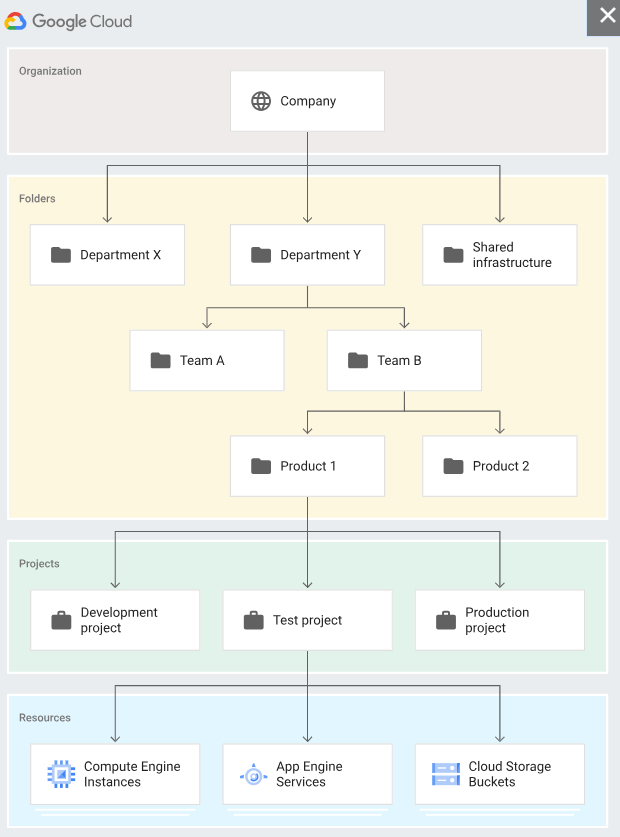
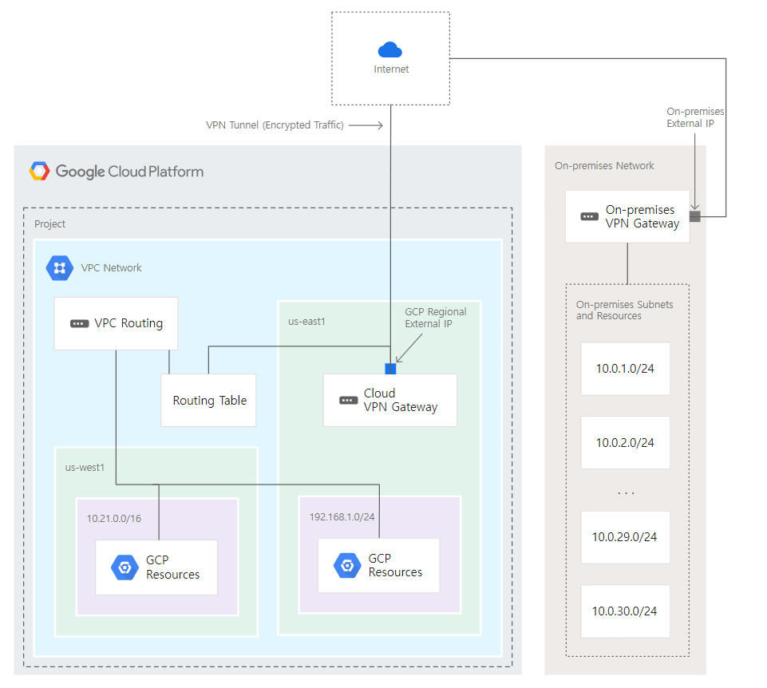
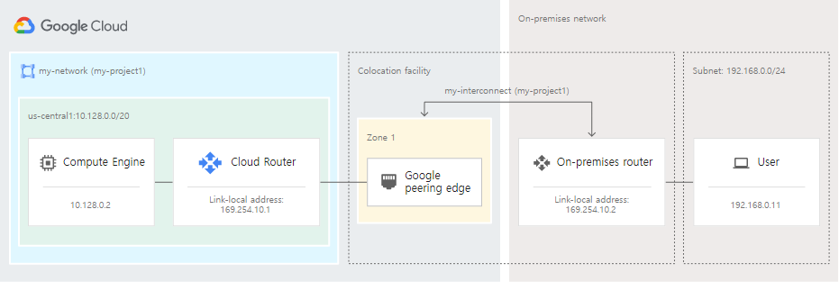
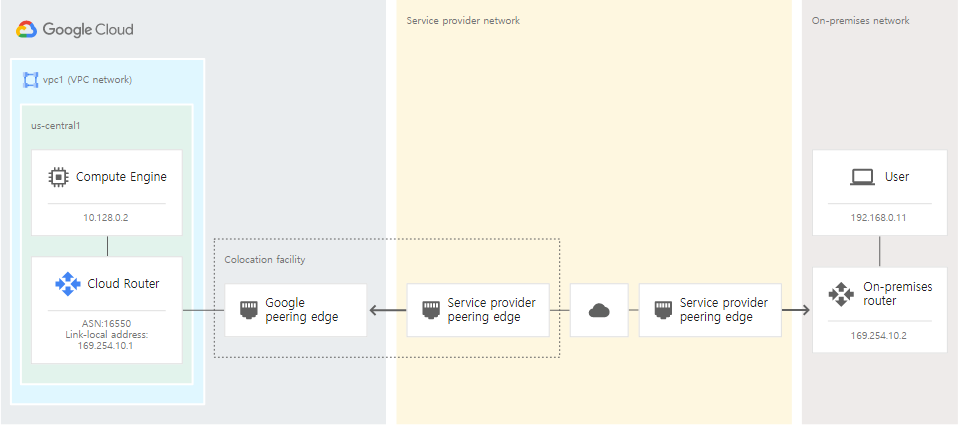

# GCP PCA(Professional-Cloud-Architect) 

## 목차
- [관련용어 정리](#관련-용어-정리)

1. `Google Cloud Resource`
    - 1.1[ Organization/Folder/Project](#organization-folder-project)
    - 1.2[ Stackdriver](#stackdriver)
    

2. `Compute Resource`
    - 2.1[ Instance Group](#instance-group)
    - 2.2[ Anthos](#anthos)
    - 2.3[ Cloud Disk 유형별 비교](#cloud-disk-유형별-비교)
    - 2.4[ App engine](#app-engine)

3. `Storage & Database Resource`
    - 3.1[ Storage & Database 시나리오](#storage--database-시나리오)
    - 3.2[ Cloud Storage](#cloud-storage)
    - 3.3[ Cloud SQL ](#cloud-sql)
    - 3.4[ Big Table/Big Query/Dataproc/Dataflow/Datastore](#big-tablebig-querydataprocdataflowdatastore)
    - 3.5[ Cloud Data Loss Prevention(Cloud DLP)](#cloud-data-loss-preventioncloud-dlp)
    - 3.6[ Cloud Datalab/ Cloud Dataprep](#cloud-datalabcloud-dataprep)

4. `Network Resource`
    - 4.1[ Shared VPC / VPC Peering](#shared-vpc--vpc-peering)
    - 4.2[ Cloud VPN / Cloud Interconnect ](#cloud-vpn--cloud-interconnect)

5. `Cloud Deployment Manager`
    - 5.1 [Cloud Deployment Manager](#cloud-deployment-manager)


6. `Kubernetes & GKE`
    - 6.1 [statefulset]()    

## 관련 용어 정리

### GDPR (General Data Protection Regulation)
- 유럽 일반 개인정보 보호법 
- 유럽 연합(EU)에서 만든 개인정보 보호 관련 법규

- GCP 리소스는 자동으로 GDPR 준수하지 않음
    - GCP 는 GDPR 프레임워크를 갖춘 안전한 기반을 제공하고, 사용자 조직이 설계·구성·운영을 책임질 때 GDPR 컴플라이언스가 완성됨

### CRM 
- 고객 관계관리 
- 현재 고객 및 잠재 고객과 관련된 정보를 관리/추적/저장 

### HIPAA
- Health Insurance Portability and Accountability Act 
- 민감한 환자 건강 정보가 환자의 동의나 인지 없이 공개되는 것을 방지하기 위해 국가 표준 
제정을 요구하는 연방법

### EHR Helthcare
- 전자 건강 기록

- 환자의 종이차트를 디지털 버전으로 만든 것

- 승인된 사용자가 정보를 즉각적이고 안전하게 사용할수 있도록 하는 사용자중심의 실시간 기록

- DUMP에서 해당 내용에 대한 케이스를 문제로 많이 출제함

### LAMP stack 
- 개발자가 웹 사이트와 웹 애플리케이션을 빌드하는 데 사용하는 4가지 소프트웨어 기술의 번들
    - Linux(운영 체제)
    - Apache(웹 서버)
    - MySQL(데이터베이스 서버)
    - PHP(프로그래밍 언어)

### PCI DSS (Payment Card Industry Data Security Standard)
- 신용카드 결제 관련 정보를 처리, 저장, 전송하는 시스템이 반드시 따라야 하는 보안 표준
- VISA, Mastercard, American Express, JCB 등 주요 카드사가 만든 표준
- 민감한 카드 소유자 정보(Cardholder Data, CHD)를 보호하기 위한 규정 집합

- Google Cloud Platform(GCP)은 PCI DSS 인증을 받은 인프라를 제공
    - 하지만 **GKE를 포함한 클라우드 서비스 위에서 운영하는 워크로드(애플리케이션)**는
고객이 PCI DSS 요건을 직접 구현하고 책임져야함

<br>

# Google Cloud Resource 


## Organization, Folder, Project


### Organization 
- 폴더 및 프로젝트 리소스의 계층적 상위 항목

- 조직 리소스에 적용된 IAM 액세스 제어 정책은 조직의 모든 리소스에 대한 계층 구조 전체에 적용

- Google Workspace 또는 Cloud ID 계정과 연결

- 조직 리소스가 있으면 프로젝트 리소스는 프로젝트를 만든 직원이 아니라 조직에 속한다
    - 직원이 퇴사하여 계정이 사라져도 프로젝트 리소스는 삭제되지않고 조직 리소스의 수명 주기를 따름

- 조직 관리자는 모든 리소스를 중앙에서 제어 가능 
    - 조직내의 모든 프로젝트 리소스를 확인 및 관리 가능
    - 조직 리소스의 모든 프로젝트 및 폴더 리소스에 상속되는 역할을 조직 수준에서 부여가능

- 소유자는 조직 리소스를 만들 때 지정
    - 소유자를 설정한 후에는 변경불가
 
- 새로 만든 조직 리소스의 초기 IAM 정책은 프로젝트 생성자 및 결제 계정 생성자 역할을 전체 Google Workspace 도메인에 부여

    - 사용자는 조직 리소스가 있기 전과 같이 프로젝트 리소스와 결제 계정 생성 가능

- 조직 리소스를 만들 때 다른 리소스는 생성되지않음

### Folder 
- 조직 리소스 내의 하위 조직

- 선택적으로 프로젝트 간에 추가 그룹화 메커니즘과 격리 경계를 제공
    - 회사 내의 다양한 법인, 부서, 팀을 모델링하는 데 사용

- 각 폴더 리소스에는 다른 팀을 나타내는 다른 하위 폴더가 포함될 수 있음
    -  각 팀 폴더는 다른 애플리케이션을 나타내는 추가적인 하위 폴더를 포함할 수 있다

- 폴더 리소스를 사용하여 관리 권한을 위임가능
 - 부서 책임자에게 해당 부서에 속하는 모든 Google Cloud 리소스의 완전한 소유권을 부여할 수 있다
 
 - 리소스에 대한 액세스 권한은 폴더 리소스별로 제한할 수 있음
    - 한 부서의 사용자는 해당 폴더 리소스 내의 Google Cloud 리소스만 액세스 가능

 - 폴더 리소스에 부여된 IAM 역할은 해당 폴더에 포함된 모든 프로젝트 및 폴더 리소스에 자동으로 상속됨

### Project 

- 기본 수준의 구성 항목

- Google Cloud를 사용하는 데 필요하며, 모든 Google Cloud 서비스 생성, 사용 설정, 사용, API 관리, 결제 사용 설정, 공동작업자 추가 및 삭제, 권한 관리를 위한 기반을 형성

- 대부분의 Google Cloud 리소스와 상호작용하려면 모든 요청에 대해 프로젝트 리소스 식별 정보 제공 필요

- 새로 만든 프로젝트 리소스의 초기 IAM 정책은 소유자 역할을 프로젝트 생성자에게 부여

<br>

## osp (operations suite)

- Google Cloud 내부와 외부에서 실행되는 애플리케이션 및 시스템에 대한 통합 모니터링, 로깅, trace 관리형 서비스

- GCP API에 대한 metric을 수집하고 이를 로그 형태로 저장하여 모니터링 등에 이용 가능

- 측정항목(metrix), 로그, 이벤트를 인프라에서 집계하고 개발자와 운영자에게 제공하여 문제 발생 시 원인 분석에 도움 제공

- 이전 명칭 : Stackdriver 

- vm에 agent형태로 설치 하여 사용

- stackdriver는 GCP뿐만 아니라 AWS, 온프레미스, 하이브리드 클라우드 등 실행 환경에 관계없이 <br> 모든 클라우드 계정 및 프로젝트 측정 항목, 로그, 메타 데이터를 포괄적으로 확인 가능 

- 특징 
    - 로그관리 
        - 모든 로그는 Cloud Logging API로 전송되어 로그라우터를 통과

    - 실시간 로그 관리 및 분석
        - BigQuery를 통해 분석 가능 

    - 대규모 측정항목 관측 가능성 기본 제공
        - Cloud Monitoring을 통해 측정내용 확인 가능 

    - Prometheus를 실행하고 확장하기 위한 독립형 관리형 서비스 
        - Managed Service for Prometheus

    - 애플리케이션 성능 모니터링 및 개선 (APM)
        -  Cloud Trace(지연시간관리) 및 Cloud Profiler(성능 및 비용관리)와 결합 가능

<br>

# Compute Resource

## Compute Engine 종류 

### 표준 VM
- Google 인프라에서 호스팅되는 가상 머신(VM)
- 일반적으로 사용하는 VM 인스턴스 형태 

### 선점형 인스턴스 (Preemptible VM, Spot VM)
-  다른 VM에 할당하기 위한 컴퓨팅 용량을 확보해야 하는 경우 이러한 인스턴스를 중지(선점)할 수 있음
    - 자동으로 중지 처리되므로 가용성에 영향

-  표준 VM 가격에 비해 훨씬 저렴한 가격(60~91% 할인)으로 이용가능

### 단독 테넌트(Sole-tenants) 

- 가상 머신(VM) 인스턴스의 테넌시
    
    - VM이 다른 Google Cloud 프로젝트의 VM과 Compute Engine 서버를 공유하는지 여부
    
    -  멀티 테넌트    
        - VM이 Compute Engine 서버를 다른 Google Cloud 프로젝트의 VM과 공유하는 경우 
        - VM은 기본적으로 멀티 테넌트
    - 단독 테넌트    
        - VM이 Compute Engine 서버를 다른 프로젝트의 VM과 공유하지 않는 경우

- Compute Engine 서버에 독점적으로 액세스해야 하는 워크로드에 적합

- Google Cloud 프로젝트에서만 VM을 호스팅하는 Compute Engine 서버인 단독 테넌트 노드에 독점적으로 액세스 가능

- 주로 byol 라이선스(Bring Your Own License)를 사용하는 VM 혹은 온 프레미스에서 GCP로 VM을 Import하여 사용하는 경우에서 사용

- 단독 테넌트 노드 구성방법 

1. 단독 테넌트 노드 템플릿 만들기. 
    - 단독 테넌트 노드 템플릿은 단독 테넌트 노드 그룹의 모든 단독 테넌트 노드에 동일한 속성을 지정

2. 이전에 만든 단독 테넌트 노드 템플릿을 사용하여 단독 테넌트 노드 그룹 생성

3. VM을 만들어 단독 테넌트 노드 그룹에 프로비저닝

## Instance Group 
- 관리형과 비관리형으로 구분

### 비관리형 인스턴스 그룹
- 다수의 인스턴스를 논리적으로 그룹화 한 것
- 로드밸런서로 연결가능해짐

### 관리형 인스턴스 그룹 (MIG)
- 고가용성
    - 실패한 VM 자동 복구 ( VM 중지/충돌/선점/삭제 시 재생성 )
    - 애플리케이션 기반 자동 복구 ( Application 체크 및 미응답시 VM 재생성)
    - 리전(멀티 영역) 노출 범위 (앱 부하 분산 가능)
    - 부하 분산 ( 트래픽 분산 )

- 확장성
    - 인스턴스 오토스케일링 지원

- 자동 업데이트
    - 새로운 버전의 소프트웨어를 MIG에 배포가능 
        - 순차적,카나리아 등의 업데이트 옵션 지원

- 스테이트풀(Stateful) 워크로드 지원
    - Stateful 구성을 사용하는 Application의 배포 빌드 및 작업  자동화 가능


### MIG Update 유형
#### Proactive Update Mode - 자동(사전형)
- 업데이트 할 구성을 VM에 자동으로 적용 
- 지정된 개수의 인스턴스를 중지 후, 신규 인스턴스를 띄워서 교체를 지원하는 형태

#### Opportunistic Update Mode - 선택적(상황별)
- 업데이트를 바로 진행하지 않고 수동으로 교체/새로고침/다시 시작 시 VM 업데이트를 진행

#### Canary updates
- 그룹의 인스턴스 하위 집합에 적용되는 업데이트

- 중단을 유발할 수 있는 업데이트를 모든 인스턴스에 출시하는 대신 인스턴스의 임의 하위 집합에서 업그레이드를 테스트 가능

- 업데이트가 잘 진행되지 않는 경우 인스턴스의 하위 집합만 롤백하면 사용자 작업 중단을 최소화

- 업데이트해야 하는 인스턴스 수가 인스턴스 그룹의 전체 크기보다 적음

- 추가 옵션을 구성하여 서비스에 대한 장애 수준을 제어가능

<br>

## Anthos 
-  Google의 클라우드 중심 컨테이너 플랫폼     

-  퍼블릭 클라우드와 온프레미스 모두에 걸친 여러 환경의 Kubernetes 클러스터를 관리하고 정책을 일관성 있게 적용 가능

- AWS나 애져(Azure) 같은 서드파티 클라우드에서 구동하는 워크로드도 관리 가능

### Anthos Service mesh
- Google에서 구현한 Istio 오픈소스 프로젝트

- 마이크로 서비스를 위한 어플리케이션에 구축된 인프라 계층

- Application 코드를 변경하지 않고도 서비스를 관리, 관찰, 보호 가능

- 트래픽 관리에서 메시 원격 분석, 서비스 간 통신 보안까지 모든 면에서 서비스 제공을 간소화
    - 운영 및 개발팀의 부담 감소

- 모니터링, 네트워킹, 보안과 같은 서비스 실행과 관련된 일반적인 문제를 모두 고려
    - 서비스 간의 통신을 제어, 표시, 관리

<br>

### Cloud Disk 유형별 비교

| 디스크 유형                                      | IOPS가 크기에 따라 증가    | 설명                                   | 주요 특징                                       |
| ------------------------------------------- | ------------------ | ------------------------------------ | ------------------------------------------- |
| `pd-ssd`<br>(SSD Persistent Disk)           | ✅ 네                | 고성능 SSD, 트랜잭션이 많은 워크로드에 적합           | - 1TB당 최대 30,000 IOPS<br>- 최대 1,200MB/s 처리량 |
| `pd-balanced`<br>(Balanced Persistent Disk) | ✅ 네                | 가격 대비 성능 균형, 일반적인 워크로드에 적합           | - 1TB당 약 10,000 IOPS<br>- 최대 600MB/s 처리량    |
| `pd-extreme`<br>(Extreme Persistent Disk)   | ⚠️ 조건부             | 사용자가 직접 IOPS/처리량 지정<br>고성능 요구 시 사용   | - 최대 120,000 IOPS<br>- 크기에 따라 설정 한계 존재      |
| `pd-standard`<br>(Standard Persistent Disk) | ⚠️ 일부 증가<br>하지만 낮음 | HDD 기반, 순차적 접근에 적합, 저비용              | - 낮은 IOPS (랜덤 읽기 성능 낮음)<br>- 최대 처리량 낮음      |
| `local-ssd`<br>(Local SSD)                  | ❌ 고정됨              | VM에 직접 연결된 물리적 SSD<br>초고속 처리 필요 시 사용 | - 인스턴스당 최대 680,000 IOPS<br>- VM 삭제 시 데이터 소실 |


<br>

### App Engine 
- Google Cloud에서 제공하는 완전 관리형 서버리스 플랫폼

- 두 가지 실행 환경(Standarad/Flexible) 을 제공 

    | 항목       | **Standard Environment**               | **Flexible Environment** |
    | -------- | -------------------------------------- | ------------------------ |
    | 실행 환경    | 샌드박스 (보안 격리)                           | Docker 기반 VM             |
    | 언어 지원    | GCP가 제공하는 언어 런타임                       | 모든 언어 가능 (Docker로)       |
    | VPC 접속   | ❌ 기본 불가<br>✅ 일부 언어 + VPC Connector로 가능 | ✅ 기본 가능                  |
    | 인프라 제어   | 제한적                                    | 루트 수준 제어 가능              |
    | 확장성      | 매우 빠름                                  | 유연하지만 상대적으로 느림           |
    | 로컬 파일 접근 | 읽기 전용                                  | 읽기/쓰기 가능                 |
    | 시작 시간    | 수 초                                    | 수십 초 이상 가능               |

- App Engine에서 온프레미스 DB 접속 가능 여부
    - GCP와 온프레미스 간 Cloud VPN 또는 Cloud Interconnect로 네트워크 연결 필요
    - Flexible 환경에서는 안정적으로 가능하나 Standard 환경에서는 일부 제약이 발생
        - Standard 환경에서 연결 시, 일부 언어 + VPC Connector가 있어야 연결가능
        - [App Engine Standard] --(VPC Connector)--> [VPC] --> [온프레미스 DB (VPN으로 연결됨)]

        - VPC Connector가 없으면, App Engine Standard 환경 또는 다른 Serverless 서비스 (예: Cloud Functions, Cloud Run)는 같은 VPC 내에 있더라도 Cloud SQL(Private IP)이나 VM에 직접 연결할 수 없음


# Storage & Database Resource

##  Storage & Database 시나리오

|서비스|시나리오|
|:-:|:-:|
|Cloud SQL|OLTP(온라인 트랜잭션 처리) 시스템에 전체 SQL 지원을 제공하는 관계형 데이터베이스가 필요한 경우|
|Cloud Bigtable|ACID 트랜잭션을 위한 지원이 필요하지 않거나 데이터의 구조화 수준이 높지 않은 경우|
|BigQuery|OLAP(온라인 분석 처리) 시스템을 위해 양방향 쿼리가 필요한 경우|
|Cloud Storage|대용량 이미지 또는 영화와 같이 변하지 않는 대용량 blob을 저장해야 하는 경우|

<br>

## Cloud Storage 
- 비정형 데이터를 저장하기 위한 관리형 서비스

- 오브젝트의 버전 관리 기능 제공

### Object Lifecycle Management

- 오브젝트 객체 수명관리 제공 

    - 객체의 TTL(Time To Live) 설정 
    - 이전 버전 객체 보관 
    - 각 객체별로 스토리지 클래스 변경 

### Cloud Storage 관련 도구 
- gsutil 
    - 업로드 및 다운로드 지원 (cp/mv/gsync) 

- gcsfuse
    - Cloud Storage를 NFS 형태로 마운트 지원

### Cloud Storage 클래스 
- 클래스는 언제든지 변경이 가능

|Class|용도|
|:-:|:-:|
|Autoclass|- 객체 수준 활동을 기준으로 각 객체를 Standard 또는 Nearline 클래스로 자동 전환<br>- 사용 빈도를 예측할 수 없는 경우 권장|
|Standard|단기 스토리지 및 자주 액세스하는 데이터에 적합|
|Nearline|백업 및 월 1회 미만 액세스하는 데이터에 적합|
|Coldline|재해 복구 및 분기당 1회 미만 액세스하는 데이터에 적합|
|Archive|연 1회 미만 액세스하는 데이터의 디지털 장기 보존에 적합|


### Transfer Appliance
- 사용자 데이터를 Cloud Storage에 업로드하는 Google 업로드 시설로 데이터를 전송하고 안전하게 배송할 수 있도록 하는 대용량 스토리지 기기

- Cloud Storage에 대량데이터를 업로드 하는경우 사용

- 작동 방식
    - GCP에서 기기를 대여 > NFS형태로 마운트하여 데이터 복사 > GCP에 반환 > Cloud Storage에 업로드

<br>

## Cloud SQL 
- 완전관리형 SQL 서버  
- MySQL, PostgreSQL, SQL Server를 위한 완전 관리형의 관계형 데이터베이스 서비스
  
- 주요 특징 
    - 완전 관리형
    - 개방형 및 표준 기반
    - 높은 비용 효율성
    - 생성형 AI 지원
    - 간편한 마이그레이션

<br>


---

## Big Table/Big Query/Dataproc/Dataflow/Datastore

| 서비스명     | 타입                        | 주요 용도 및 역할                                           | 특징 및 장점                                                |
|--------------|-----------------------------|----------------------------------------------------------|------------------------------------------------------------|
| BigTable     | NoSQL 광폭 열(Column) 데이터베이스  | 저지연성, 대규모 읽기/쓰기, IoT, 클릭스트림 등 대용량 데이터 저장 및 처리 | 고성능, 수평 확장 가능, HBase 및 Cassandra 호환, 실시간 대용량 처리 적합 |
| BigQuery     | 완전관리형 서버리스 데이터 웨어하우스 (OLAP) | 페타바이트 단위 대규모 데이터에 대한 SQL 기반 분석 및 쿼리           | 확장성 높음, 빠른 쿼리 성능, 저장과 컴퓨팅 분리, 쉬운 데이터 분석          |
| Dataproc     | 관리형 Apache Spark, Hadoop 클러스터 서비스 | 데이터 처리 클러스터 생성 및 관리, 빅데이터 일괄 처리 및 분석           | 간편한 클러스터 관리, 기존 Hadoop/Spark 워크로드 재사용 가능            |
| Dataflow     | 완전관리형 스트림 및 일괄 데이터 처리 서비스 | 실시간 및 일괄 데이터 파이프라인 처리, ETL, 스트리밍 분석               | 서버리스, 자동 확장, Apache Beam 기반, 복잡한 데이터 처리 파이프라인 지원  |
| Datastore   | 관리형 NoSQL 문서형 데이터베이스       | 웹 및 모바일 앱 용도로 빠른 읽기/쓰기 및 확장 가능한 트랜잭션 지원      | 완전 관리형, 자동 확장, ACID 트랜잭션 지원, 쉬운 개발


### Datastore와 Bigtable 비교
 - Bigtable
    - 와이드 컬럼 기반의 대용량, 저지연 NoSQL DB로 수십억 건 이상의 초대용량 데이터를 빠르게 저장하고 분석 가능
 - Datastore
    - 문서(document) 중심의 NoSQL 데이터베이스로, 복잡한 구조화된 데이터와 트랜잭션을 지원하며 웹/모바일 애플리케이션에 적합
    
- Datastore와 Bigtable 비교
    - Datastore는 구조화된 애플리케이션 데이터에 적합
    - Bigtable은 대규모 로그, 클릭스트림, IoT 데이터 등 빅데이터 처리에 적합


### Big Table
- 대규모 분석 및 운영 워크로드를 위한 확장 가능한 완전 관리형 NoSQL 데이터베이스 서비스
- NoSQL 와이드 컬럼 데이터베이스

- 특징 
    - 짧은 대기 시간, 많은 수의 읽기 및 쓰기, 대규모 성능 유지에 최적화
    - 읽기 및 쓰기 측면에서 크게 확장해야 하는 애플리케이션을 만들 때 사용
    - Bigtable 처리량은 노드를 추가/제거하여 조정가능.
        -   각 노드는 초당 최대 10,000개의 쿼리 (읽기 및 쓰기)를 제공
    - Hadoop, Dataflow 및 Dataproc과 같은 기존 빅 데이터 도구와 쉽게 통합 가능

### Big Query 
- 대량의 관계형 구조화된 데이터를 위한 엔터프라이즈 데이터 웨어하우스
- 데이터를 쉽게 수집, 저장, 분석, 시각화하도록 설계된 페타바이트 규모의 데이터 웨어하우스

- 특징 
    - 대규모 임시 SQL 기반 분석 및 보고에 최적화
    - BigQuery를 사용하여 Cloud Bigtable의 데이터를 분석 가능
    - 일반적인 BigQuery 사용 사례에는 대규모 저장 및 분석 또는 OLAP(온라인 분석 처리)가 포함

- 명령어     
    - `bq show` : 모든 job 확인 가능
    - `bq ls`  : 각 job의 정보 확인 가능

<br>


## Dataproc
- 빅데이터 처리용 완전 관리형 Spark/Hadoop 클러스터를 제공하는 PaaS 서비스
    - 주로 대규모 데이터 처리, 분석, ETL(추출, 변환, 적재), 머신러닝 작업 등에 사용
    - Spark, Hadoop MapReduce, Hive, Pig 등 다양한 빅데이터 오픈소스 도구를 활용하여 일괄 처리, 쿼리, 스트리밍, 머신러닝 작업을 수행 가능

<br>


## Dataflow
- 주요 특징
    - **데이터 파이프라인을 코드로 정의해 클라우드에서 손쉽게 데이터를 이동·변환·분석하도록 돕는 서버리스 빅데이터 처리 서비스**
    - 통합 스트림 및 일괄 데이터 처리를 대규모로 제공하는 Google Cloud 서비스
    - Apache Beam 프로젝트 기반으로 구축됨 
    - 하나 이상의 소스에서 읽은 데이터로 파이프라인을 만들고, 데이터를 변환하고, 데이터를 대상에 기록 가능


- 주 사용 사례

    - 데이터 이동
        - 하위 시스템 간 데이터 수집 또는 복제

    - BigQuery와 같은 데이터 웨어하우스로 데이터를 수집하는 ETL(추출, 변환, 로드) 워크플로
    
    - BI 대시보드 지원
    
    - 스트리밍 데이터에 실시간 ML 적용
    
    - 대규모 센서 데이터 또는 로그 데이터 처리

## DataStore
- Google Cloud에서 제공하는 완전 관리형 NoSQL 문서 데이터베이스

- 웹 및 모바일 애플리케이션에서 구조화된 데이터를 효율적으로 저장하고 관리하기 위해 설계됨

- 주요 특징 
    - 자동 확장 및 고가용성
    - ACID 트랜잭션 지원
    - 유연한 데이터 모델
    - SQL 유사 쿼리 제공
    - 강력한 일관성(Strong consistency)
    - 다양한 GCP 서비스와 통합

<br>

## Cloud Data Loss Prevention(Cloud DLP)
- 개인 식별 정보(PII)와 같은 민감한 정보를 대규모로 식별하고 보호할 수 있는 Google Cloud의 완전 관리형 서비스

- Cloud Storage, Datastore, BigQuery를 스캔하여 민감 정보를 감지하고, 해당 정보의 저장 위치와 데이터의 유형, 사용되는 방법을 식별 가능

- 조직 전반에서 Cloud DLP 검사를 지속적으로 실행 시, BigQuery에 새 테이블 데이터가 추가될 때 자동으로 데이터 프로파일링을 실행
    

- Cloud DLP의 사전 정의된 감지기
    - 별도 프로그래밍을 통한 로직 작성 없이 민감 정보의 패턴, 형식 등을 식별 가능
    - 데이터의 복제 없이도 마스킹, 토큰화, 가명처리 등의 데이터 익명화 가능

<br>

## Cloud Datalab/Cloud Dataprep


### Cloud Datalab
- Jupyter 기반의 데이터 과학 분석 환경

- GCP에서 제공하는 대화형 노트북(notebook) 서비스

- Python 기반으로 빅쿼리, 머신러닝, 시각화 등을 수행 가능

- `2022년 10월에 사용 중단(EOL)`

### Cloud Dataprep

- 코드 없이(코드리스) 데이터 정제를 할 수 있는 UI 기반 데이터 준비 도구

- 비정형 또는 반정형 데이터를 클릭 몇 번으로 정제, 필터링, 변환할 수 있음

- ETL(Extract-Transform-Load) 또는 ELT 파이프라인 구성에 유리함

- `2026.03 EOL 예정`


<br>


# Network Resource

## Shared VPC / VPC Peering

### Shared VPC
- 여러 프로젝트가 공유해서 사용할 수 있는 VPC network

- 프로젝트 하나를 호스트 프로젝트로 지정하고 여기에 하나이상의 다른 서비스프로젝트를 연결하여 호스트 프로젝트의 VPC 네트워크를 공유
    - 호스트 프로젝트의 VPC를 다른 프로젝트에서 사용가능하도록 하는것 

- Shared VPC는 동일 조직내의 프로젝트만 연결 가능
    - GCP의 경우 서로 다른 organization이 VPC를 공유하는 것은 불가능하고 같은 organization 하위의 프로젝트들은 VPC를 공유 가능

    - 연결된 프로젝트는 다른폴더에 존재가능 
        - 폴더가 다른 경우 관리자가 두 폴더에 대한 공유 VPC 권한 소유해야함

- Shared VPC에 사용가능한 리소스 
    - IP 주소 
    - 내부 DNS 
    - 부하 분산

### VPC Peering
- 2개의 Virtual Private Cloud(VPC) 네트워크를 연결하여 각 네트워크의 리소스가 통신 가능하도록 하는 역할

- 서로 다른 organization, project의 VPC 네트워크라도 public 을 거치지 않고 통신 가능하게 해줌

- 내부 통신을 가능하게 해줌으로써 다음과 같은 이득을 얻을 수 있음
    - Low latency : 내부연결은 외부 연결보다 지연시간 짧음
    - Security : 공개 인터넷에 서비스를 노출할 필요가 없어 리스크 감소
    - 비용 측면 : 외부IP 사용시 Egress 비용 청구됨 

- 조건
    - 하나의 VPC 네트워크에 여러 개의 VPC 네트워크를 피어링할 수 있지만 제한 존재
    - 각 VPC 별로 Peering 설정해주어야함
        - 하나의 VPC만 설정하면 연결 x 
    - 피어링된 VPC 네트워크의 서브넷 IP 범위는 겹칠 수 없다

- 3개의 VPC를 연결하는 경우 
    ```
    A <-- peering --> B  <-- peering --> C
    ```
    - 다음 형태로 연결된 VPC의 경우 A 와 C에대한 연결을 따로 지정하지 않으면 통신 불가

### Direct Peering
- 비즈니스 네트워크와 Google 에지 네트워크 사이에 다이렉트 피어링 연결을 설정
    - 대용량 클라우드 트래픽을 교환 가능


- 다이렉트 피어링과 Cloud Interconnect 비교

|다이렉트 피어링|Cloud Interconnect|
|:-|:-|
|- Google Cloud에서 사용할 가능 <br> - Google Cloud가 필수는 아님|Google Cloud가 필요|
|전체 Google Cloud 제품군에 온프레미스 네트워크에서 Google Workspace 및 Google API로의 직접 액세스를 제공|- Google Workspace 액세스 불가<br> - 온프레미스 네트워크에서 다른 모든 Google Cloud 제품 및 서비스에는 액세스 가능<br>-  온프레미스 호스트에서 비공개 Google 액세스를 사용하여 지원되는 API 및 서비스에도 액세스 가능|
|- 내부 IP 주소만 있는 VPC 네트워크 리소스에 대한 직접 액세스는 제공 x|- 내부 IP 주소만 있는 VPC 네트워크 리소스에 대한 직접 액세스 제공|
|설치 또는 유지보수 비용 없음|유지보수 비용 존재|
|Google 에지 네트워크에 연결|Google 에지 네트워크에 연결| 
|- Google Cloud 리소스를 사용 X <br>- 구성은 Google Cloud 프로젝트에 불투명|- Interconnect 연결, VLAN 첨부, Cloud Router와 등의 Google Cloud 리소스 사용|
|- 온프레미스 네트워크의 목적지 IP 주소 범위 변경시 Google에 문의 필요|- Cloud Router와 공유하는 경로를 조정을 통해 온프레미스 네트워크의 목적지 IP 주소 범위를 변경가능|
|- 온프레미스 네트워크로 가는 경로는 Google Cloud 프로젝트의 VPC 네트워크에 표시 X|- 온프레미스 네트워크로 가는 경로가 프로젝트의 Cloud Router에 의해 학습되고 VPC 네트워크에 커스텀 동적 경로로 적용|
|- 서비스수준계약(SLA)을 제공 X|- 엔드 투 엔드 SLA를 제공|


<br>

## Cloud VPN / Cloud Interconnect 
- GCP VPC를 On-Premise의 네트워크와 연결해야 하는 경우 사용됨.
- VPC 네트워크를 Cloud VPN, Interconnect 통해 다른 네트워크에 연결한 경우 기본 및 보조 범위는 온프레미스 IP 범위와 충돌할 수 없음.

- `Cloud VPN / Cloud Interconnect 비교` 
    |Cloud VPN |Cloud Interconnect |
    |:-:|:-:|
    |- 보안데이터 전송<br>- 처리량이 낮은 솔루션<br>- 원격 엑세스 가능해야함<br>- 공용인터넷에 접속이 필요|- 빠른 연결 속도와 낮은 대기 시간 필요<br>- 트래픽이 공개 인터넷을 통하지 않아야 하는경우<br>- 비공개 액세스가 필요한경우|


### Cloud VPN


- VPN Tunnel을 통해 온프레미스 네트워크와 연결 제공
- 안전한 전송을 보장하기 위해 공용 인터넷을 통해 데이터를 암호화
- 보안데이터 전송 , 처리량이 낮은 솔루션, 원격 엑세스, 공용인터넷에 접속 등이 필요한경우 사용 

- 기본 VPN과 HA VPN 제공 
    - HA VPN 
        - 99.99% 서비스 가용성의 SLA를 제공
        - 두개의 터널로 연결

### Cloud Interconnect 

- 매우 빠른 연결 속도와 낮은 대기 시간이 필요
- 트래픽이 공개 인터넷을 통하지 않아야 하는경우 
- 온프레미스 리소스에서 GCP 리소스에 대한 비공개 액세스가 필요한경우
    - 비공개로 유지되는 물리적 연결 제공
- Dedicate Interconnect와 Partner Interconnect로 구분

#### Dedicate Interconnect


- 온 프레미스 네트워크와 Google 네트워크 간의 직접적인 물리적 연결을 제공


#### Partner Interconnect


- 지원되는 서비스 제공 업체를 통해 온 프레미스 네트워크와 VPC 네트워크 간의 연결을 제공
    - 서비스 제공 업체와 협력하여 VPC와 온 프레미스 네트워크를 연결

### Cloud Endpoint 
- GCP 에서 제공하는 API 게이트웨이 역할을 하는 경량형 API 
- NginX로 배포되어 프록시 형태로 동작
- API 인증/모니터링/로깅 기능 제공 


## Google Cloud ML Engine
- 대규모로 머신러닝 학습 작업과 예측을 실행하기 위한 호스팅 플랫폼

<br>

## Cloud Deployment Manager	

- GCP에서 인프라를 코드로(IaC, Infrastructure as Code) 관리할 수 있게 해주는 도구
- 선언적 구성 파일을 작성하여 GCP 리소스를 자동으로 생성, 구성 및 관리 가능 

- 주요 특징 

    | 항목           | 설명                                     |
    | ------------ | -------------------------------------- |
    | **서비스 이름**   | Cloud Deployment Manager               |
    | **주요 목적**    | 인프라 자원을 코드로 정의하고 자동으로 배포               |
    | **구성 파일 포맷** | YAML 또는 Python, Jinja2 템플릿             |
    | **지원 리소스**   | GCE, GKE, VPC, Cloud SQL 등 GCP 대부분 리소스 |
    | **작동 방식**    | 선언적 구성 → 템플릿 렌더링 → API 호출로 리소스 생성      |

- 장점
    - 반복 가능하고 일관된 배포 가능
    - 선언적 문법으로 직관적인 구성
    - 템플릿 재사용성이 높음
    - GCP의 IAM과 결합해 보안 관리 용이

- 단점 
    - Terraform보다 생태계와 유연성이 부족
    - 복잡한 조건/루프 처리에 제한이 있음
    - GCP 외의 클라우드 리소스와 통합하기 어렵다
    - 2023년 이후 기능 추가가 거의 없고, 공식적으로는 권장되지 않음
        - → 구글은 Terraform 또는 다른 IaC 도구를 선호하는 방향으로 가는 중


## Kubernetes & GKE 

### Statefulset
- 상태가 있는(stateful) 애플리케이션을 Kubernetes에서 안정적으로 운영할 수 있도록 해주는 워크로드 리소스
-  일반적인 Deployment와는 다르게 각 Pod에 고유한 정체성과 스토리지를 보장
    - ReplicaSet처럼 문제가 생긴 Pod을 다시 만들 때, 동일한 이름과 IP로 유지하고 싶다면 StatefulSet을 사용

- Deployment/Statefulset 비교
    | 항목      | Deployment  | StatefulSet                        |
    | ------- | ----------- | ---------------------------------- |
    | 파드 이름   | 랜덤 또는 자동 생성 | 고정된 이름 (예: `my-app-0`, `my-app-1`) |
    | 스토리지    | 공유하거나 새로 생성 | 파드마다 고유한 PVC                       |
    | 네트워크 ID | 랜덤          | 고정 (DNS: `pod-name.service-name`)  |
    | 파드 순서   | 병렬 생성/삭제    | 순차적 생성/삭제 (예: 0 → 1 → 2)           |
    | 용도      | 무상태 웹 서버 등  | DB, Kafka, Zookeeper 등 상태 있는 앱     |


