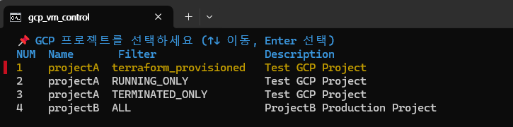
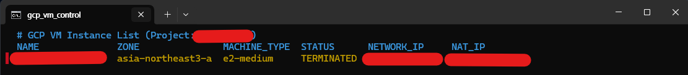
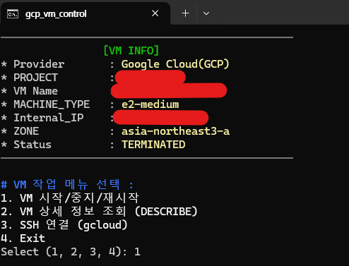
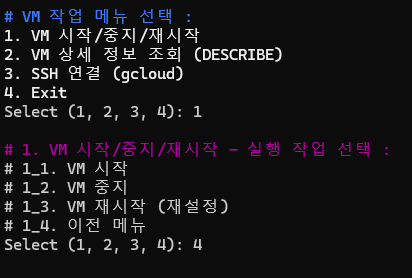
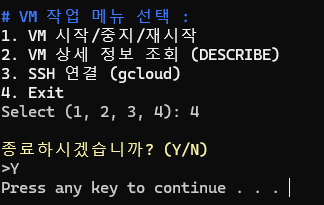

## 추가 - 여러 GCP 프로젝트 내 Instance를 관리 + 프로젝트별 Filter 지정


### 주요 변경 사항 
- 만약 Google Cloud SDK와 fzf 가 없다면 자동으로 설치하는 Batch 파일을 구성

- 여러 GCP 프로젝트내의 VM을 컨트롤 가능하도록 별도 프로젝트 목록을 구성 후 로드 
    - google-cloud-cli 상에서 모든 프로젝트에 접근 가능하도록 gcloud config 구성 필요 

- 기존 하나의 bat파일을 기능별로 서브 bat파일로 분할

- 각 프로젝트별로 --filter 구문을 분리하여, 프로젝트별로 컨트롤 가능한 VM 범위를 조정 
    - 해당 구문은 별도 bat 파일로 분리하여 추가/변경이 용이하도록 변경 

- 기존 시작/중지 뿐아니라 재설정, Describe, ssh 연결이 가능하도록 수정 
    - ssh 연결 시, OSLOGIN 옵션이 필요하며, 사용자의 기본 ssh 키 경로에 있는 키파일을 metadata로 등록 후 사용


## 상세 구성

### 디렉토리 구성 
```
gcp_win_bat
├── main.bat
├── setup.bat
├── config
│   └── gcp_project_list.txt
└── scripts
    ├── gcloud_commands.bat
    └── gcp_vm_control.bat
    └── Check-Gcloud-Fzf-Install.ps1
```

### 1. config
#### `gcp_project_list.txt`
- 스크립트를 사용하여 VM을 관리할 GCP 프로젝트 목록
- 각 프로젝트별 Project_ID, VM 목록 추출 시 사용될 filter, Description을 명시
- main.bat 에서 해당 파일을 로드하여 fzf로 선택

- 맨 위 두줄은 header로 사용됨 
- 스페이스를 통해 간격을 조정해야 보이는대로 fzf에서 출력됨

    ```
    📌 GCP 프로젝트를 선택하세요 (↑↓ 이동, Enter 선택)
    NUM  Name       Filter                 Description
    1    ProjectA  terraform_provisioned   Test GCP Project
    2    ProjectA  RUNNING_ONLY            Test GCP Project
    3    ProjectA  TERMINATED_ONLY         Test GCP Project
    4    ProjectB   ALL                    B Production Project
    ```


### 2. scripts 

#### `Check-Gcloud-Fzf-Install.ps1`

- Setup.bat 에서 실행되는 Powershell 스크립트 
- 현재 Windows 환경에 `Google Cloud SDK`가 설치되어있는지 확인 후, 없는경우 설치 
    - 이미 설치되어있다면 Skip
- 현재 사용자의 bin 디렉토리 내에 `fzf.exe` 파일이 존재하는지 확인 후, 없는경우 설치 
    - 공식 github에서 latest 태그 기준으로 파일을 다운로드 
    - Windows 64bit 용 파일을 다운로드 하므로 다른 환경에서는 변경 필요

    <br>

    ```ps
    <#
    .SYNOPSIS
      gcloud와 fzf를 체크/설치하는 스크립트
    #>

    function Test-CommandExists {
        param([string]$Command)
        return $null -ne (Get-Command $Command -ErrorAction SilentlyContinue)
    }

    Write-Host "`n=== Checking prerequisites ===`n"

    try {
        # 1) Google Cloud SDK 설치 확인
        if (-not (Test-CommandExists gcloud)) {
            Write-Host "[INFO] Google Cloud SDK not found. Installing..."
            $gcloudUrl  = "https://dl.google.com/dl/cloudsdk/channels/rapid/GoogleCloudSDKInstaller.exe"
            $gcloudFile = Join-Path $env:TEMP "GoogleCloudSDKInstaller.exe"

            Invoke-WebRequest -Uri $gcloudUrl -OutFile $gcloudFile -ErrorAction Stop
            Start-Process -FilePath $gcloudFile -ArgumentList "/SILENT" -Wait -ErrorAction Stop
            Remove-Item $gcloudFile -ErrorAction SilentlyContinue

            Write-Host "[DONE] Google Cloud SDK installed. Please run 'gcloud init'."
    		Write-Host ""
        }
        else {
            Write-Host "[SKIP] Google Cloud SDK가 이미 설치됨"
    		Write-Host ""
        }

        # 2) fzf 설치 확인
        $targetBinDir = Join-Path $env:USERPROFILE "bin"
        $fzfExe       = Join-Path $targetBinDir "fzf.exe"

        if (-not (Test-Path $fzfExe)) {
            Write-Host "[INFO] fzf not found. Installing latest version via GitHub API..."

            # 2.1) GitHub API로 최신 릴리스 정보 가져오기
            $apiUrl  = "https://api.github.com/repos/junegunn/fzf/releases/latest"
            $release = Invoke-RestMethod -Uri $apiUrl -UseBasicParsing -ErrorAction Stop

            # 2.2) windows_amd64 ZIP asset 찾기
            $asset   = $release.assets `
                        | Where-Object { $_.name -match "windows_amd64\.zip$" } `
                        | Select-Object -First 1
            if (-not $asset) {
                throw "fzf Windows asset not found in latest release."
            }

            $zipUrl  = $asset.browser_download_url
            $tempZip = Join-Path $env:TEMP "fzf-latest.zip"
            $extract = Join-Path $env:TEMP "fzf_extract"

            # 2.3) 다운로드
            Invoke-WebRequest -Uri $zipUrl -OutFile $tempZip -UseBasicParsing -ErrorAction Stop

            # 2.4) 임시 폴더 초기화
            if (Test-Path $extract) {
                Remove-Item $extract -Recurse -Force
            }

            # 2.5) 압축 해제
            Expand-Archive -Path $tempZip -DestinationPath $extract -ErrorAction Stop

            # 2.6) bin 폴더 생성
            if (-not (Test-Path $targetBinDir)) {
                New-Item -ItemType Directory -Path $targetBinDir | Out-Null
            }

            # 2.7) fzf.exe 복사
            Copy-Item -Path (Join-Path $extract "fzf.exe") -Destination $targetBinDir -Force

            # 2.8) User PATH에 bin 추가 (case-insensitive)
            $userPath = [Environment]::GetEnvironmentVariable("Path","User")
            if (-not ($userPath.Split(';') -contains $targetBinDir)) {
                [Environment]::SetEnvironmentVariable("Path", "$userPath;$targetBinDir", "User")
                Write-Host "[DONE] Added '$targetBinDir' to User PATH. Re-open your shell."
            } else {
                Write-Host "[SKIP] '$targetBinDir' already in User PATH."
            }

            # 2.9) 임시 파일 정리
            Remove-Item $tempZip -ErrorAction SilentlyContinue
            Remove-Item $extract -Recurse -Force -ErrorAction SilentlyContinue

            Write-Host "[DONE] fzf 설치 완료."
    		Write-Host ""

        }
        else {
            Write-Host "[SKIP] fzf 이미 설치됨"
    		Write-Host ""
        }
    }
    catch {
        Write-Error "[ERROR] $_"
        exit 1
    }
    ```

#### `gcloud_commands.bat`
- main.bat에서 프로젝트 선택 후 호출되는 서브 bat 파일
- 프로젝트 리스트 목록에 명시된 filter 값에 따라 사용할 gcloud 구문을 명시

    ```bat
    @echo off

    :: ========== 기본 설정  ==========
    :: - UTF-8 코드 페이지 사용 ( CMD 내 한글 출력을 위함 )
    chcp 65001 >nul

    :: - 변수값 실시간 갱신기능 활성화
    setlocal enabledelayedexpansion


    :: ========== 기본 변수 설정  ==========

    :: bat파일 호출시 할당한 인자를 변수로 할당 
    :: 1번 인자 : PROJECT_LIST_NUM 변수 
    :: 2번 인자 : GCP 프로젝트 리스트 파일 
    :: * 참고 - call로 호출된 bat 파일에서는 메인 bat 파일에서 선언된 변수를 그대로 사용가능
    set PROJECT_LIST_NUM=%1
    set PROJECT_LIST_FILE=%2


    :: ========== 목록에서 GCP 프로젝트 및 필터 선택  ==========
    :: - 선택된 PROJECT_LIST_NUM 을 기준으로 PROJECT명과 Filter를 추출 
    :: - Filter 명으로 등록된 label로 이동하여 gcloud 명령을 실행 
    goto SELECT_PROJECT
    :SELECT_PROJECT
    set "TARGET_LABEL="


    for /f "tokens=1-3" %%a in (!PROJECT_LIST_FILE!) do (
        if /I "%%a"=="!PROJECT_LIST_NUM!" (
    		set "PROJECT=%%b"
    		set "TARGET_LABEL=%%c"
    	)
    )

    if not defined TARGET_LABEL (
        echo [ERROR] Project "!PROJECT!" not found in PROJECT List
        exit /b
    )

    goto !TARGET_LABEL!
    exit /b


    :: FOR 문 내에서 2개 이상의 명령을 실행하기위해 Powershell Command로 지정 
    :: CMD For 구문 내 Powershell Command 는 한줄로 입력해야만 정상 작동 
    :ALL
    FOR /F "delims=" %%i IN ('powershell -Command "Write-Output '# GCP VM Instance List (Project: !PROJECT!)'; gcloud compute instances list --project=!PROJECT! --format='table(name,zone,machineType,status,networkInterfaces[0].networkIP,networkInterfaces[0].accessConfigs[0].natIP)'" ^| fzf --layout=reverse-list --header-lines=2') DO (
        echo %%i
    )
    exit /b

    :RUNNING_ONLY
    FOR /F "delims=" %%i IN ('powershell -Command "Write-Output '# GCP VM Instance List (Project: !PROJECT!)'; gcloud compute instances list --project=!PROJECT! --format='table(name,zone,machineType,status,networkInterfaces[0].networkIP,networkInterfaces[0].accessConfigs[0].natIP)' --filter='status:RUNNING'" ^| fzf --layout=reverse-list --header-lines=2') DO (
        echo %%i
    )
    exit /b

    :TERMINATED_ONLY
    FOR /F "delims=" %%i IN ('powershell -Command "Write-Output '# GCP VM Instance List (Project: !PROJECT!)'; gcloud compute instances list --project=!PROJECT! --format='table(name,zone,machineType,status,networkInterfaces[0].networkIP,networkInterfaces[0].accessConfigs[0].natIP)' --filter='status:TERMINATED'" ^| fzf --layout=reverse-list --header-lines=2') DO (
        echo %%i
    )
    exit /b


    :terraform_provisioned
    FOR /F "delims=" %%i IN ('powershell -Command "Write-Output '# GCP VM Instance List (Project: !PROJECT!)'; gcloud compute instances list --project=!PROJECT! --filter='labels.goog-terraform-provisioned:true' --format='table(name,zone,machineType,status,networkInterfaces[0].networkIP,networkInterfaces[0].accessConfigs[0].natIP)'" ^| fzf --layout=reverse-list --header-lines=2') DO (
    	echo %%i
    )
    exit /b
    ```


#### `gcp_vm_control.bat`
- main.bat 파일 내에서 호출하여 사용하는 서브 bat 파일
- VM 선택 후 실행할 작업 별로 label을 구성

    ```bat
    @echo off
    :: ========== 기본 설정  ==========
    :: - UTF-8 코드 페이지 사용 ( CMD 내 한글 출력을 위함 )
    chcp 65001 >nul

    :: - 변수값 실시간 갱신기능 활성화
    setlocal enabledelayedexpansion


    :: ========== 선택된 VM 대상 실행 작업 선택  ==========
    :: - VM 시작/중지/재시작, Describe, SSH 연결 중 선택하여 실행 
    :: - VM 시작/중지/재시작 선택시 하위 선택 메뉴 실행 
    :: - 모든 작업은 실행 완료 시, 작업 선택 메뉴로 돌아옴 

    :: - 작업 메뉴 표출 
    :SELECT_COMMAND
    echo.
    set choice=""
    powershell -command ^
    "Write-Host \"# VM 작업 메뉴 선택 : \" -ForegroundColor Blue; ^
    Write-Host \"1. VM 시작/중지/재시작\" -ForegroundColor White; ^
    Write-Host \"2. VM 상세 정보 조회 (DESCRIBE)\" -ForegroundColor White; ^
    Write-Host \"3. SSH 연결 (gcloud)\" -ForegroundColor White; ^
    Write-Host \"4. Exit\" -ForegroundColor White"
    set /p choice="Select (1, 2, 3, 4): "
    echo.

    :: - 선택 메뉴에 따라 label로 이동하여 작업 실행 
    if "!choice!"=="1" goto SELECT_CONTROL_ACTION	
    if "!choice!"=="2" goto DESCRIBE_VM
    if "!choice!"=="3" goto CONNECT_VM
    if "!choice!"=="4" goto EXIT_BATCH
    powershell -command "Write-Host \"!잘못된 입력입니다. 다시 선택해주세요. \" -ForegroundColor Red"
    goto SELECT_COMMAND

    :: - 1. VM 시작/중지/재시작 선택 시 하위 메뉴 호출 
    : SELECT_CONTROL_ACTION
    powershell -command "Write-Host \"# 1. VM 시작/중지/재시작 - 실행 작업 선택 : \" -ForegroundColor Magenta"
    echo # 1_1. VM 시작
    echo # 1_2. VM 중지
    echo # 1_3. VM 재시작 (재설정)
    echo # 1_4. 이전 메뉴
    set /p control_choice="Select (1, 2, 3, 4): "
    echo.

    if "!control_choice!"=="1" goto START_VM
    if "!control_choice!"=="2" goto STOP_VM
    if "!control_choice!"=="3" goto RESET_VM
    if "!control_choice!"=="4" goto SELECT_COMMAND
    powershell -command "Write-Host \"!잘못된 입력입니다. 다시 선택해주세요. \" -ForegroundColor Red"
    goto SELECT_CONTROL_ACTION	

    :: 1-1. 선택한 VM 기동 명령 실행 
    :START_VM
    echo # Action : START VM Instance
    gcloud compute instances start !INSTANCE! --project=!PROJECT! --zone=!ZONE! | more 
    pause
    goto SELECT_COMMAND

    :: 1-2. 선택한 VM 중지 명령 실행 
    :STOP_VM
    echo # Action : STOP VM Instance
    gcloud compute instances stop !INSTANCE! --project=!PROJECT! --zone=!ZONE! | more 
    pause
    goto SELECT_COMMAND

    :: 1-3. 선택한 VM 재시작 명령 실행 
    :RESET_VM
    echo # Action : RESET VM Instance
    gcloud compute instances reset !INSTANCE! --project=!PROJECT! --zone=!ZONE! | more 
    pause
    goto SELECT_COMMAND

    :: 2. 선택한 VM DESCRIBE 명령 실행 
    :: VM label 내 한글이 들어가는 경우 출력이 깨지는 경우가 발생하므로 powershell 커맨드로 실행 
    :DESCRIBE_VM
    echo # Action : DESCRIBE VM Instance
    powershell -Command ^
    "$OutputEncoding = [Console]::OutputEncoding = [System.Text.Encoding]::UTF8; ^
    gcloud compute instances describe '!INSTANCE!' --project='!PROJECT!' --zone='!ZONE!'"
    pause
    goto SELECT_COMMAND

    :: 3. 선택한 VM SSH 연결 실행 (gcloud를 통해 연결)
    :CONNECT_VM
    echo # Action : SSH Connect to Instance
    set /p SSH_USER="SSH 연결 계정 입력 : "
    gcloud compute ssh !SSH_USER!@!INSTANCE! --project=!PROJECT! --zone=!ZONE! | more 
    pause
    goto SELECT_COMMAND

    :: 4. 작업 종료 선택시, 종료 확인 후 
    :EXIT_BATCH
    powershell -command "Write-Host \"!종료하시겠습니까? (Y/N) \" -ForegroundColor Yellow"
    set /p confirm=">"
    if /I "%confirm%"=="Y" goto END_BATCH
    if /I "%confirm%"=="N" goto SELECT_COMMAND
    powershell -command "Write-Host \"!잘못된 입력입니다. 다시 선택해주세요. \" -ForegroundColor Red"
    echo 
    goto SELECT_COMMAND

    :END_BATCH
    pause
    ```


### 실행용 bat 파일 

#### `setup.bat`
    - google cloud sdk , fzf 설치 확인 후, 미설치시 설치를 진행하는 bat파일 
    - ps1 파일만으로는 직접 실행이 어려우므로 bat파일에서 ps1파일을 실행하는 형태로 구성 

    ```bat
    @echo off
    setlocal
    chcp 65001 >nul

    :: → Get-ExecutionPolicy 결과를 먼저 받고, 그 값에 대해 -ne 연산자를 사용
    powershell -NoProfile -Command ^
      "if ((Get-ExecutionPolicy -Scope CurrentUser) -ne 'RemoteSigned') { Set-ExecutionPolicy RemoteSigned -Scope CurrentUser -Force }"

    :: 메인 스크립트 실행
    powershell -NoProfile -ExecutionPolicy Bypass -File "scripts\Check-Gcloud-Fzf-Install.ps1"
    if %ERRORLEVEL% neq 0 (
      echo [ERROR] 설치 중 오류 발생.
    ) else (
      echo [OK] 설치가 완료되었습니다.
    )

    pause
    ```

* `main.bat`
    - 실행용 메인 bat파일

```bat
@echo off
:: ========== 기본 설정  ==========
:: - UTF-8 코드 페이지 사용 ( CMD 내 한글 출력을 위함 )
chcp 65001 >nul

:: - 변수값 실시간 갱신기능 활성화
setlocal enabledelayedexpansion

:: ========== 기본 변수 설정  ==========
:: - Provider 변수는 'Google Cloud(GCP)' 로 고정 
:: - gcloud  실행용 bat 파일 및 GCP 프로젝트 리스트 파일 지정 
set PROVIDER=Google Cloud(GCP)

::- 현재 스크립트가 있는 경로를 BASE_DIR 변수로 지정
set "BASE_DIR=%~dp0"

:: - 서브 bat 파일 위치지정 
set gcloud_bat_file=%BASE_DIR%scripts\gcloud_commands.bat
set gcp_vm_control_bat_file=%BASE_DIR%scripts\gcp_vm_control.bat

:: - PROJECT 리스트 파일 위치 지정 
set "gcp_project_list_file=%BASE_DIR%config\gcp_project_list.txt"

:: ========== GCP 프로젝트 선택  ==========
:: - GCP 프로젝트 선택 - gcp_project_list.txt 내 프로젝트 목록을 불러와서 fzf 실행 
:: - 해당 파일의 맨 위 두개 라인을 header로 사용 
FOR /F "delims=" %%i IN ('type !gcp_project_list_file! ^| fzf --layout=reverse-list --header-lines=2') DO (
    set "SELECTED=%%i"
)

:: - fzf 실행 후, 선택된 라인에서 PROJECT_LIST_NUM 추출 (공백 기준 첫 번째 컬럼)
FOR /F "tokens=1" %%i IN ("!SELECTED!") DO (
    set "PROJECT_LIST_NUM=%%i"
)

:: - fzf 실행 후, 선택된 라인에서 프로젝트 ID 추출 (공백 기준 두 번째 컬럼)
FOR /F "tokens=2" %%i IN ("!SELECTED!") DO (
    set "PROJECT=%%i"
)

:: ========== 선택된 프로젝트 내 VM INSTANCE 선택  ==========
:: - 프로젝트 선택용 fzf 실행 후, 선택된 프로젝트에 따라 gcloud command 호출 
:: - gcloud 명령 실행용 bat에 정의된 label(:xxx)을 호출하여 VM INSTANCE 선택용 fzf 실행 
:: - 각 프로젝트 별로 gcloud filter 문을 다르게 설정함 
FOR /F "delims=" %%i IN ('call !gcloud_bat_file! !PROJECT_LIST_NUM! !gcp_project_list_file!') DO (
    set "SELECTED_INSTANCE=%%i"
)
 
:: - VM INSTANCE 선택용 fzf 실행 후, 선택된 라인에서 VM 정보를 추출 
:: - 컬럼 순서 대로 각 변수 값에 할당 하여 사용 
:: - 1번 부터 5번까지 차례로 변수로 지정 ( 첫번째  토큰 변수를 a로 지정시 a,b,c 순으로 자동 지정)
FOR /F "tokens=1-5" %%a IN ("!SELECTED_INSTANCE!") DO (
    set "INSTANCE=%%a"
    set "ZONE=%%b"
    set "MACHINE_TYPE=%%c"
    set "STATUS=%%d"
    set "INTERNAL_IP=%%e"
)

:: ========== 선택된 프로젝트/VM 정보 출력 ==========
:: - 각 단계를 통해 선택된 프로젝트/VM 의 정보를 출력
:: - 글자 색을 지정하기 위해 powershell Command 사용 
:: - powershell command를 여러번 사용시 느려지는 현상이 발생하므로 한번의 powershell command만 호출하도록 설정 
powershell -Command ^
"Write-Host \"──────────────────────────────────────────────\" -ForegroundColor DarkGray; ^
Write-Host \"`t`t[VM INFO]\" -ForegroundColor Green; ^
Write-Host \"* Provider       :\" -NoNewline; Write-Host \" !PROVIDER!\" -ForegroundColor Yellow; ^
Write-Host \"* PROJECT        :\" -NoNewline; Write-Host \" !PROJECT!\" -ForegroundColor Yellow; ^
Write-Host \"* VM Name        :\" -NoNewline; Write-Host \" !INSTANCE!\" -ForegroundColor Yellow; ^
Write-Host \"* MACHINE_TYPE   :\" -NoNewline; Write-Host \" !MACHINE_TYPE!\" -ForegroundColor Yellow; ^
Write-Host \"* Internal_IP    :\" -NoNewline; Write-Host \" !INTERNAL_IP!\" -ForegroundColor Yellow; ^
Write-Host \"* ZONE           :\" -NoNewline; Write-Host \" !ZONE!\" -ForegroundColor Yellow; ^
Write-Host \"* Status         :\" -NoNewline; Write-Host \" !STATUS!\" -ForegroundColor Yellow; ^
Write-Host \"──────────────────────────────────────────────\" -ForegroundColor DarkGray"


call !gcp_vm_control_bat_file!
```


## 사용 예시

1. `프로젝트 선택`

 

2. `선택된 프로젝트 및 Filter에 따라 VM 목록을 로드`
    - 해당 VM 목록에서 작업을 수행할 VM 선택 
    
 

3. `VM 정보 확인 및 작업 선택`
    - 선택된 VM의 정보를 확인하고 작업 메뉴를 표출 

    

    
    - 1번 메뉴 선택시 하위 메뉴 호출

         


4. `작업 종료 선택 시 확인`
    - 작업종료 선택시 확인 후 종료

     