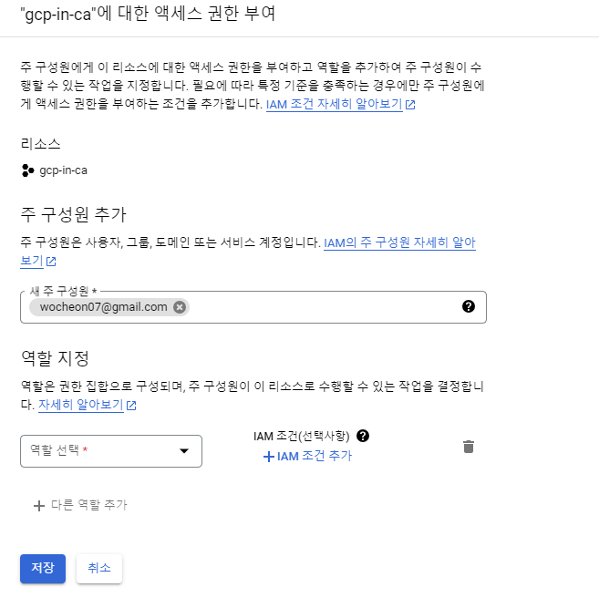
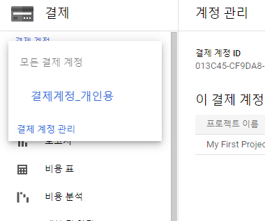
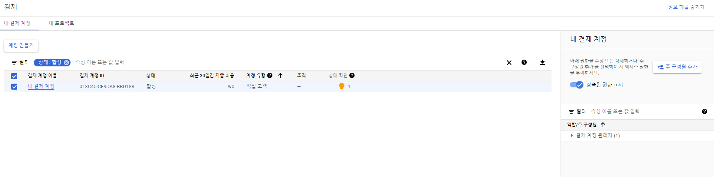
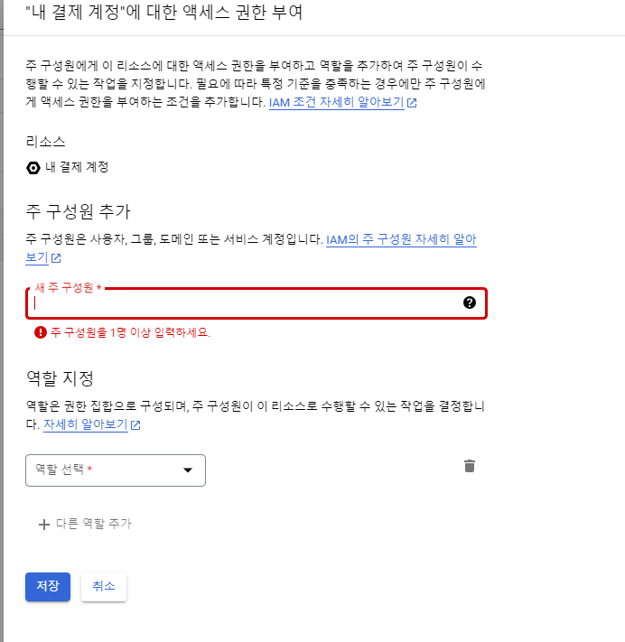

## GCP 계정 초대 방법
- 프로젝트 단위에서 IAM 설정을 통해 다른 인원을 프로젝트에 초대가능 
    - IAM > 엑세스 권한 부여 > 새 주구성원에 Gmail 주소입력후 역할 할당하여 추가

    - 역할별 권한 내용

    |역할|권한|
    |:-:|:-:|
    |소유자|프로젝트 내 모든 리소스에 대한 역할 및 관리, 프로젝트에 대한 결제 설정|
    |편집자|뷰어권한에 리소스변경과 같이 상태변경작업까지 포함됨|
    |뷰어|읽기 전용작업에 대한 권한 부여 기존 리소스 또는 데이터 조회 가능|

    - gmail로 프로젝트 초대메일 발송되며 수락하면 바로 사용이 가능
                
        - 초대한 인원이 프로젝트 소유자와 동일한 명의의 계정인 경우 초대메일 발송되지않음
        
        

## GCP 결제 계정 설정 방법

### 결제 계정 확인

- 현재 프로젝트에 연결된 결제 계정 확인 필요

- 소유자, 편집자등의 권한이 부여되면 현재 프로젝트에 연결된 결제계정을 확인 가능
    - 소유자나 편집자 권한이 있더라도 결제 계정 권한이 없다면 비용표, CUD분석등을 확인 불가 (보고서는 가능)

- 해당 결제 계정의 소유자가 누구인지 파악해야함
    - 결제계정을 처음으로 등록한 사람이 자동으로 관리자로 지정됨

### 결제 계정 권한 부여
- 해당 결제 계정 권한을 가진 사람에게 결제 계정 관리자 혹은 결제계정 뷰어 권한 요청 
    - 결제 > 왼쪽 위 드랍박스 선택 > 결제 계정 관리 
        
    혹은 처음 결제 화면에서 결제 계정관리를 선택
        
    - 오른쪽 위 정보패널 표시 활성화 후 결제 계정을 선택 
        
    - 결제계정 엑세스 권한을 부여
        
