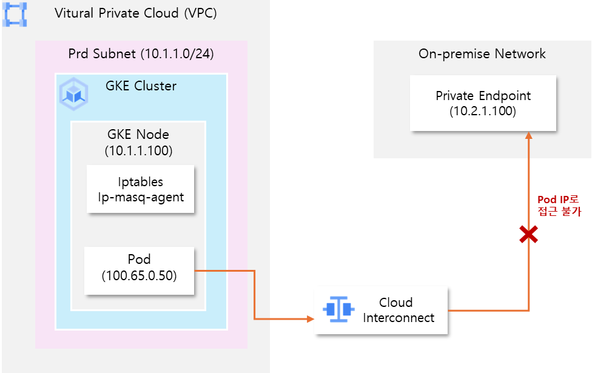

# GKE (Google Kubernetes Engine) SNAT(Source NAT) 구성

## 개요 
GKE(Google Kubernetes Engine)에서는 Pod에서 전송되는 패킷의 소스 IP를 노드 IP로 변경하여 전송이 가능합니다. 이와 같이 목적지 IP를 변경하는 기술을  SNAT (Source NAT)라 하며, 노드 내 iptables의 Masquerade 규칙에 따라 결정됩니다.

## 1\. GKE의 기본 SNAT 기능에 따른 SNAT 동작
- GKE의 SNAT 동작 여부는 클러스터 설정 중 ‘기본 SNAT’ 활성화 여부에 따라 결정됩니다.  

###  **GKE 기본 SNAT 기능 활성화 여부에 따른 SNAT 동작**   
    
1. 기본 SNAT 기능이 비활성화 된 경우  
    - 클러스터 내 ip-masq-agent Daemonset이 배포되지 않으며, 모든 패킷은 소스 Pod의 IP 주소를 유지합니다.

2. 기본 SNAT 기능이 활성화 되어있으나 ip-masq-agent의 configmap 설정을 진행하지 않은 경우   
    - GKE 클러스터 구성시 기본 SNAT 기능이 활성화됨에 따라 클러스터에 자동으로 ip-masq-agent Daemonset이 배포 됩니다. 그러나 별도의 configmap 설정이 없으므로 기본 비매스커레이드 대상을 제외한 나머지 대역이 SNAT 대역으로 지정됩니다.

3. 기본 SNAT 기능활성화 및 p-masq-agent의 configmap 설정을 완료 한 경우  
    - GKE 클러스터 구성시 기본 SNAT 기능을 활성화 하면 클러스터에 자동으로 ip-masq-agent Daemonset이 배포 됩니다. 또한 해당 Daemonset의 configmap 설정에 따라 SNAT 대역이 결정됩니다.

* 참고 \- configmap을 지정하지 않았을때 설정되는 기본 비 매스커레이드 대역은 다음과 같으며, 해당 대역으로 전송되는 패킷은 Pod IP가 소스 IP로 유지됩니다. 또한 내부 메타데이터 서버 등으로 사용되는 링크-로컬 대역도 대상에 포함됩니다.

- **기본 비마스커레이드 대역**
  - 10.0.0.0/8
  - 172.16.0.0/12
  - 192.168.0.0/16
  - 100.64.0.0/10
  - 192.0.0.0/24
  - 192.0.2.0/24
  - 192.88.99.0/24
  - 198.18.0.0/15
  - 198.51.100.0/24
  - 203.0.113.0/24
  - 240.0.0.0/4

- **링크-로컬 대역**
  - 169.254.0.0/16

<br>

## **2\. GKE 내 SNAT 구성 방법** 

### **2.1. GKE 노드 내 iptables 설정 방식**

- 각 노드에 SSH등을 통해 접근하여 root 권한으로 iptables에 Masquerade 규칙을 수동으로 추가하여 사용합니다.
  - **ex) Pod IP 대역에서 Private Endpoint로 나가는 경우 SNAT 규칙을 추가**  
  ```bash
  # Iptables 규칙 추가 
  $ iptables -t nat -A POSTROUTING -s 100.64.0.0/16 -d 10.1.2.100 -j MASQUERADE

  # Iptables 규칙 삭제
  $ iptables -t nat -D POSTROUTING -s 100.64.0.0/16 -d 10.1.2.100 -j MASQUERADE

  # Iptables 규칙 조회 
  $ iptables -t nat -L POSTROUTING -n -v –line-numbers
  ```

### 장점/단점  
- **장점**   
  - 특정 대역에 대해서만 SNAT가 필요한 경우 사용 가능   
  - ip-masq-agent가 지원하지 않는 복잡한 규칙을 적용할 수 있음  
    ex) 특정 프로토콜만 허용, 로그 기록 등  
  - 각 노드별로 별개의 설정을 적용할 수 있음  
- **단점**  
  - 노드 재기동 및 재생성, 업데이트 등의 작업이 발생할때마다 새로 설정 필요  
  - GKE 내 다른 네트워크 에이전트들에 의해 초기화 혹은 재설정 될 가능성 존재 


### **2.2 GKE  ip-masq-agent configmap 적용**
- 기본 SNAT 기능을 사용하여 ip-masq-agent Daemonset이 배포되어있다면, configmap을 적용하여 SNAT 대역을 관리할 수 있습니다.

####  **ex) 10.1.1.0/24, 10.1.2.0/24 대역을 SNAT 대상에서 제외하는 경우**  
  > configmap.yaml
  ```yaml
  apiVersion: v1
  kind: ConfigMap
  metadata: 
    name: ip-masq-agent
    namespace: kube-system
  data
    config:  |
      nonMasqueradeCIDRS:
        - 10.1.1.0/24
        - 10.1.2.0/24
      masqLinkLocal : false #링크-로컬 대역을 SNAT 대역에 추가 여부
      resyncInterval : 60s
  ```
  - ip-masq-agent용 configmap 생성
  ```sh
  $ kubectl create configmap ip-masq-agent –namespace=kube-system –from-file=config=configmap.yaml 
  ```
### 장점/단점

- **장점**  
  - ip-masq-agent가 존재하는 모든 노드에 한번에 적용   
  - daemonset으로 구성되므로 노드 재기동 등의 작업이 발생하더라도 설정 유지  
- **단점**  
  - iptables에 비해 세밀한 규칙 설정이 불가능함  
    ex) nonMasqueradeCIDRs 만 추가 가능하며, SNAT를 실행할 대역을 직접 지정 불가 

<br>


## **3\. 구성 시나리오 \- Private Endpoint 연결을 위한 GKE SNAT 설정**

### AS-IS 구성 


- On-premise 환경은 Cloud Interconnect를 통해  VPC와 직접 연결된 상태   
- GKE 클러스터는 기본 SNAT 기능이 활성화되어 ip-masq-agent Daemonset이 배포되어있음  
- GKE Pod에서 On-premise 환경 내에 구성된 Private Endpoint를 통해 API호출 필요  
- 노드IP \-\> Private Endpoint간 연결은 가능하지만, Pod IP \-\> Private Endpoint는 연결 불가  
-  Private Endpoint의 대역이 10.0.0.0/8 대역에 포함되어 SNAT가 발생하지 않음  
- On-premise Network 정책 상 Pod IP 대역을 허용하도록 설정 할 수 없음 

#### 1. GKE 노드 내 Private Endpoint 연결 테스트
```bash
$ nc -vz 10.2.1.100 443
(UNKNOWN) [10.2.1.100] 443 (https) open
# -> 노드 상에서는 정상 연결 가능한 상태임을 확인
```

#### 2. GKE Pod 내 Private Endpoint 연결 테스트
- 2.1\. 연결 테스트용 Pod 생성을 위한 yaml 파일 구성
> connection-test-pod.yaml
```yaml
apiVersion: v1
kind: Pod 
metadata:
  name: connection-test-pod
spec:
  containers:
  - name: connection-test-pod
    image: nicolaka/netshoot # telnet, curl 등의 명령을 포함하는 이미지
    command: [“sleep”, “3600”] 

```

- 2.2\.  연결 테스트 용 Pod 생성
```bash
$ kubectl apply -f connection-test-pod.yaml

$ kubectl get pods -o wide | grep connection-test-pod
connection-test-pod    1/1     Running    0    10s     100.65.0.50    [nodename]    <none>    <none>
```

- 2.3\. Pod 내에서 telnet 명령을 실행하여 연결 가능 여부 확인

```bash
$ kubectl exec -it connection-test-pod – timeout 3 telnet 10.2.1.100 443
command terminated with exit code 143
# -> Pod IP로는 Private endpoint로 연결 불가능
```


---

### **TO-BE 구성**


- ip-masq-agent의 configmap설정을 통해 각 노드에 적용  
- Pod에서 Private Endpoint에 접근시 SNAT가 발생하여 소스 IP가 노드 IP로 변경되도록 설정

#### 1. **ip-masq-agent 용 configmap yaml파일 구성**

**\> configmap.yaml**
```yaml
apiVersion: v1
kind: ConfigMap
metadata: 
  name: ip-masq-agent
  namespace: kube-system
data
  config:  |
    nonMasqueradeCIDRS:
# 10.0.0.0/8 대역 외 기본 비 마스커레이딩 영역은 유지 ( 기존 서비스 영향 최소화를 위함)
     - 172.16.0.0/12
     - 192.168.0.0/16
     - 100.64.0.0/10
     - 192.0.0.0/24
     - 192.0.2.0/24
     - 192.88.99.0/24
     - 198.18.0.0/15
     - 198.51.100.0/24
     - 203.0.113.0/24
     - 240.0.0.0/4
# 운영 서브넷 대역을 추가 
     - 10.1.1.0/24
    masqLinkLocal : false
    resyncInterval : 60s

```

#### 2. **kubectl 명령을 통해 configmap 생성** 

```sh
$ kubectl create configmap ip-masq-agent –namespace=kube-system –from-file=config=configmap.yaml
```


#### 3. **노드 내 iptables 규칙 적용 확인**  
- GKE Node에 접근 후 iptables를 확인

```sh
$ iptables -t -nat -L IP-MASQ

target    port    opt    source        destination
RETURN    all    –    anywhere 172.16.0.0/12    /* ip-masq-agent: local traffic is not subject to MASQUERADE */
RETURN    all    –    anywhere 192.168.0.0/16    /* ip-masq-agent: local traffic is not subject to MASQUERADE */
RETURN    all    –    anywhere 100.64.0.0/10    /* ip-masq-agent: local traffic is not subject to MASQUERADE */
RETURN    all    –    anywhere 192.0.0.0/24    /* ip-masq-agent: local traffic is not subject to MASQUERADE */
RETURN    all    –    anywhere 192.0.2.0/24    /* ip-masq-agent: local traffic is not subject to MASQUERADE */
RETURN    all    –    anywhere 192.88.99.0/24    /* ip-masq-agent: local traffic is not subject to MASQUERADE */
RETURN    all    –    anywhere 198.18.0.0/15    /* ip-masq-agent: local traffic is not subject to MASQUERADE */
RETURN    all    –    anywhere 198.51.100.0/24    /* ip-masq-agent: local traffic is not subject to MASQUERADE */
RETURN    all    –    anywhere 203.0.113.0/24    /* ip-masq-agent: local traffic is not subject to MASQUERADE */
RETURN    all    –    anywhere 240.0.0.0/4    /* ip-masq-agent: local traffic is not subject to MASQUERADE */
RETURN    all    –    anywhere 10.1.1.0/24    /* ip-masq-agent: local traffic is not subject to MASQUERADE */
MASQUERADE   all    – anywhere    anywhere     /* ip-masq-agnet: outbound traffic is subject to MASQUERADE (must be last chain) */ random-fully
```

#### **4\. Pod 내에서 telnet 명령을 실행하여 연결 가능 여부 확인**

```sh
$ kubectl exec -it connection-test-pod – timeout 3 telnet 10.2.1.100 443
Trying 10.2.1.100 …
Connected to 10.2.1.100.
# > Pod내에서 Private Endpoint 연결시 SNAT 가 발생하여 정상 연결 확인**
```