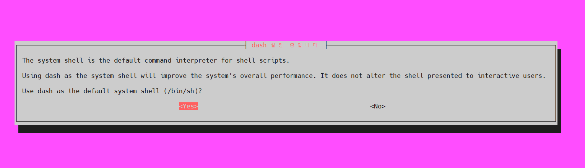

# Ubuntu 기본 쉘 변경

- Ubunt VM 생성 시, 기본 쉘이 dash로 지정되어있음 

- dash 쉘?
    - 경량화되고 POSIX 표준을 엄격하게 준수하는 쉘
    - 주로 시스템 초기화 스크립트나 성능이 중요한 환경에서 사용
    

### Bash와 비교
| 항목               | Dash                                  | Bash                                   |
|------------------|------------------------------------|-------------------------------------|
| 목적 및 설계 철학      | 경량화, 성능 최우선, 시스템 초기화 스크립트 용 | 확장 기능 포함, 대화형과 복잡한 스크립트 지원      |
| 기능 수준            | 최소한의 POSIX 표준 기능만 제공             | 배열, 별칭, 히스토리, 자동완성 등 풍부한 기능 포함   |
| 대화형 사용 적합도      | 낮음                                  | 높음                                  |
| 메모리 사용량 및 속도    | 적음, 빠름                              | 많음, 상대적으로 느림                       |
| /bin/sh 연결       | 대부분 Debian/Ubuntu에서 Dash로 연결           | 기본적으로는 아니지만, Bash도 /bin/sh 모드 가능      |
| 스크립트 호환성 및 이식성 | POSIX 기반이라 이식성 높음                     | 확장기능 사용시 호환성 저하 가능                     |


### Dash -> Bash로 변경이 필요한 이유? 
- 기본 쉘이 dash인 경우, sh 명령을 통해 스크립트 실행 시 오류가 발생할 수 있음 
    - bash에서 지원하는 확장 기능, bash 전용 문법을 포함한 스크립트를 실행하는 경우 

- 오류 발생 예시 
    - 배열(Array) 사용
    - 중괄호 확장(Brace expansion) 
        - EX) {1..10}
    - 문자열 조작 관련 확장 기능 
        - EX) ${var//pattern/replacement}
    - 함수 선언 및 사용의 차이 
        - EX) Bash는 함수 선언 시 function fname {} 문법을 지원 하지만 dash는 미지원
    - 조건문과 테스트 명령어 차이
        - EX) Bash에서만 가능한 복잡한 조건문이나 [[ ... ]] 테스트 구문 사용 시 오류 발생 (Dash는 [ ... ] 만 지원)
    - 히어 도큐먼트 복잡한 구문
        - EX) cat << EOF 를 사용해 여러 줄의 텍스트를 표준입력으로 넘김김
            ```
            cat << EOF 
            a
            b
            c
            EOF
            ```

    - 명령어 대체(command substitution) 차이
        - bash에서는 백틱(`command`), $() 가 모두 사용가능 하나, dash에서 $()는 제한적으로 지원


## 현재 기본 쉘 확인 
```bash
# 현재 시스템 확인 (Ubuntu 20.04)
root@dev:~$ uname -ar
Linux dev 5.15.0-1081-gcp #90~20.04.1-Ubuntu SMP Fri Apr 4 18:55:17 UTC 2025 x86_64 x86_64 x86_64 GNU/Linux

# 기본 지정 쉘 확인 
root@dev:~$ ls -l /bin/sh
lrwxrwxrwx 1 root root 4  7월 19  2019 /bin/sh -> dash
```

## 기본 쉘 변경
- 기본 쉘을 bash로 변경
```
$ dpkg-reconfigure dash
```

- 다음과 같은 창이 뜨면 `<NO>` 선택

```
'/bin/sh의 /bin/sh.distrib(으)로 전환, dash 패키지' 지우는 중
'/bin/sh의 /bin/sh.distrib(으)로 전환, bash 패키지' 추가하는 중
'/usr/share/man/man1/sh.1.gz의 /usr/share/man/man1/sh.distrib.1.gz(으)로 전환, dash 패키지' 지우는 중
'/usr/share/man/man1/sh.1.gz의 /usr/share/man/man1/sh.distrib.1.gz(으)로 전환, bash 패키지' 추가하는 중
```

## 기본 쉘 변경 확인 

```sh
root@dev:~$ ls -l /bin/sh
lrwxrwxrwx 1 root root 4  9월  2 11:24 /bin/sh -> bash
```
