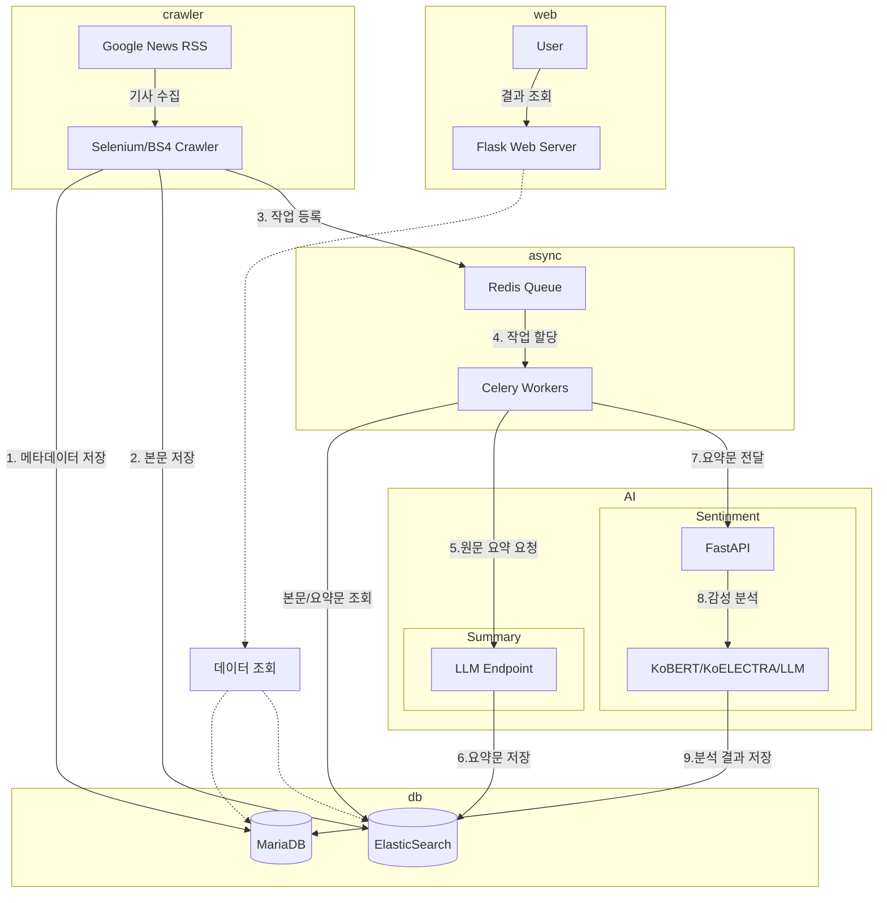

# AI 모델을 활용한 기사 감성 분석용 아키텍쳐 (v2)

## 개요 
- 기사 수집 및 요약/감성분석을 제공하는 아키텍쳐를 구성
- 기사 요약에는 LLM을 활용하며 감성분석에는 KoBERT, KoELECTRA, Qwen3을 활용
- AI 처리 작업을 Redis Queue와 Celery Workers를 활용한 비동기 처리 방식으로 변경
- 각 모델별 감성 분석결과를 웹페이지를 통해 시각화 하여 제공

## 아키텍쳐 구성

- 특정 키워드 및 카테고리에 대한 기사를 수집하여 DB 및 ES에 저장
- Redis Queue에 등록되면 해당 기사에 대한 요약 및 감성 분석을 수행
    - LLM을 통해 기사 원문에 대한 요약 수행하여 별도 ES Index에 저장
    - 감성분석을 통해 각 모델에 따른 기사의 긍정/부정/중립 여부를 확인
- DB 및 ES 내 저장된 결과를 토대로 Flask Web Server를 통해 사용자에게 시각화 제공

## 버전 별 주요 차이점 
- v1
    - 요약 및 감성분석 배치를 별도로 실행 필요 

- v2
    - Redis Queue와 Celery Workers를 활용한 비동기 처리 방식으로 변경
    - 크롤러가 수집 후 바로 요약 및 감성분석 작업을 등록하면 워커가 이를 처리

## 사용 기술 스택
- 크롤링: Selenium, BeautifulSoup4
- 데이터 저장: MariaDB, ElasticSearch
- 메시지 큐: Redis
- 비동기 처리: Celery
- LLM: OpenAI API, vLLM
- 감성 분석 모델: KoBERT, KoELECTRA, Qwen3
- 웹 프레임워크: FastAPI, Flask
- 배포: Docker

